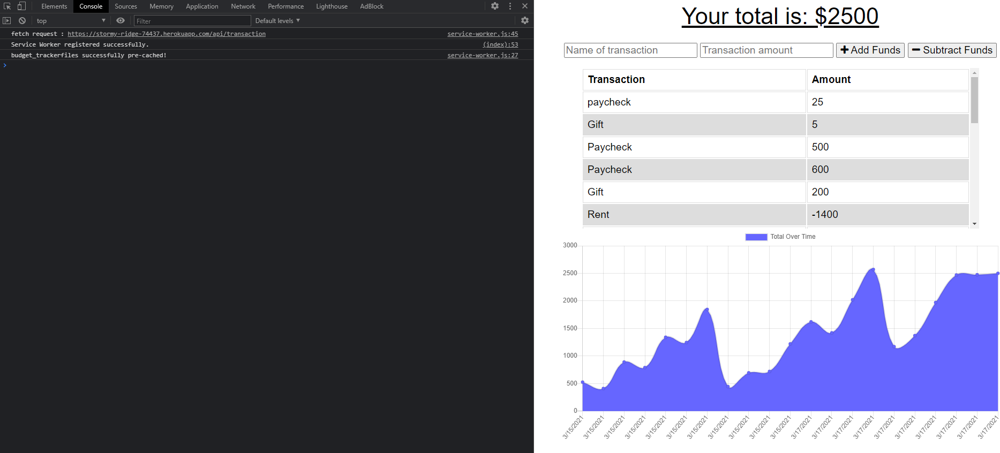

# Budget Tracker Galore!

## Links
**Live Deployment:** https://stormy-ridge-74437.herokuapp.com/
 
 
**Github Repo:** https://github.com/jwilferd10/Budget-Tracker-Galore

## Screenshot Example:

## Table of Contents 
  - [Description](#description)
  - [User Story](#user-story)
  - [Resources Used](#resources-used)
  - [Installation](#installation)
  - [Usage](#usage)
  - [Contact Information](#contact-information)

## Description:
Giving users a fast and easy way to track their money is important, but allowing them to access that information at any time is even more important. Having offline functionality is paramount to the success of an application that handles users’ financial information. Like most challenges I've worked on in the past, this introduction into PWA's was best described as grueling despite some understanding how the concepts work. However putting it into practice somehow proved to be harder then I expected, but thankfully after investing the time to overcome the issues that did pop up I do certainly feel like I've learned a whole lot in this particular experience.

## User Story
**AS A social media startup**
- I WANT an API for my social network that uses a NoSQL database
  - SO THAT my website can handle large amounts of unstructured data

**GIVEN a budget tracker without an internet connection**
- WHEN the user inputs an expense or deposit
  - THEN they will receive a notification that they have added an expense or deposit
- WHEN the user reestablishes an internet connection
  - THEN the deposits or expenses added while they were offline are added to their transaction history and their totals are updated

## Resources Used

    "compression": "^1.7.4",
    "express": "^4.17.1",
    "mongoose": "^5.5.15",
    "morgan": "^1.9.1"

## Installation
Install this project by clicking the *GREEN* button above, you can download it by ZIP or copy the SSH!

## Usage
1) Enter a name of the transaction
2) Enter the amount for the transaction
3) Pick between adding or subtracting funds
4) To test offline open "Inspect"
5) Check console log to see if Service Workers are installed correctly
6) Click on the Application Tab and check if the Manifest and Social Workers are working
7) Use Network to toggle offline and online capabilities, make sure to add funds
 
## Contact Information
- ### [jwilferd10](https://github.com/jwilferd10)
